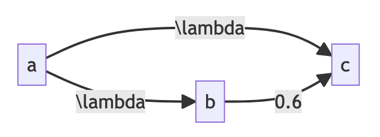

## Generate LaTeX code for Markov chains

Simple application for generating latex code for ODE system (Kolmogorov equations). Supports only Markov chain with direct paths and no cycles. 


#### Example

From this mermaid snippet: 
```
graph LR;
    a-- \lambda -->b;
    a-- \lambda -->c;
    b-- 0.6 --> c;
```

we can get latex code:

```
\begin{cases}
\dfrac{dp_a}{dt} = -\lambda_{ab} p_{a}(t) - \lambda_{ac} p_{a}(t) \\[10pt]
\dfrac{dp_b}{dt} = \lambda_{ab}  p_{a}(t) \\[10pt]
\dfrac{dp_c}{dt} = \lambda_{ac}  p_{a}(t) 
\end{cases}
```

system of equations:

```math
\begin{cases}
\dfrac{dp_a}{dt} = -\lambda_{ab} p_{a}(t) - \lambda_{ac} p_{a}(t) \\[10pt]
\dfrac{dp_b}{dt} = \lambda_{ab}  p_{a}(t) \\[10pt]
\dfrac{dp_c}{dt} = \lambda_{ac}  p_{a}(t) 
\end{cases}
```

and figure:



#### Run

After cloning the repository: 

```
cd mm_kolmogorov_ode
python3 -m venv .venv
source .venv/bin/activate
pip install -r requirements.txt
streamlit run app.py
```

In case of several installed streamlit versions use:

```
.venv/bin/python -m streamlit run app.py
```

#### Options 

* From adjancecy matrix: build from mermaid code json, adjancecy matrix and the generate latex from matrix
* From mermaid code: build latex from mermaid code directly (skip json and matrix)

There are no any differences except order of positive and negative terms in final equations

